# Sky130 Day 1 - Inception of open-source EDA, OpenLane and Sky130 PDK

## How to talk to computers :-

### Structure of a chip: 

A chip on a board, Arduino for example is as below: 
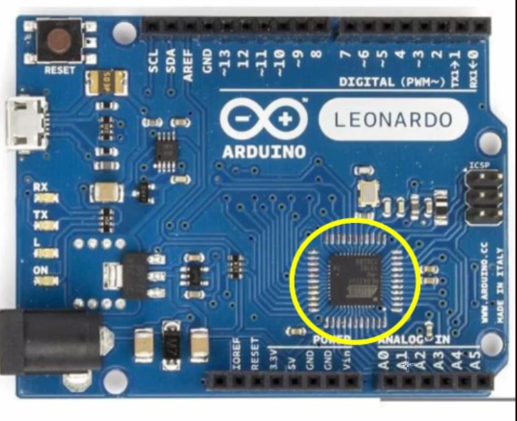

This is how it looks as is out of the box, the encircled part is the chip and the peripherals attached 
to it on the board are meant for functions like I/O, Memory, and communication modules like UART, I2C 
etc. 

The architectural view of the same is as seen below: 
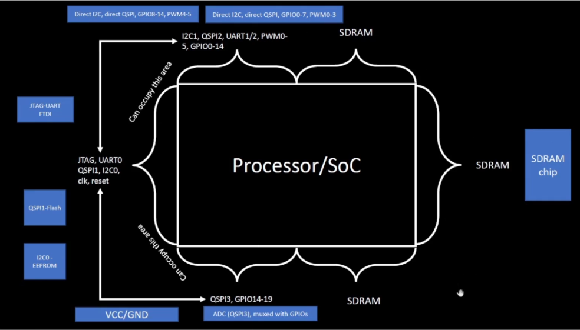

Now as for the chip alone, it's view on peripherals alone or 'package' aould be like this: 
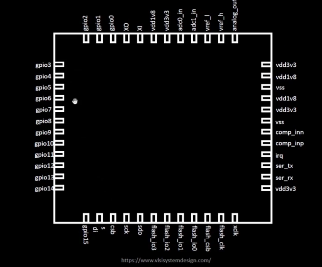

This shows all the pins that can connect to this chip, pins such as GPIO, clock etc are seen here. 
Inside this chip lies the core - the foundry IPs and the macros and then around this we have pads 
through which connections pass from the ports in the packaging as seen in the image, to the core. 

### RISC-V ISA, apps to hardware: 
Apps are writtten in languages, let us assume a piece of software written in C for simplicity, then 
there's the compiler which compiles the C code into assembly level code. these compilers work based on 
the instruction set architecture of the underlying hardware on which the program is to run, while there 
are 2 main categories - CISC and RISC. RISC-V as obvious from it's name is a reduced instruction set 
architecture, the code once complied into this is put through the assembler which puts out raw 
instructions that runs in binary(machine code) on the hardware. RISC-V 64 means each such instruction as 
put out for by the assembler is 64 bits or 8 bytes long. 

Although there are intermediate processes involving loaders and linkers, this serves to be a broad 
overview on what is happening to these software programs at the hardware level. 

## SoC design and OpenLane :- 
what you need to be able to build and asic? 
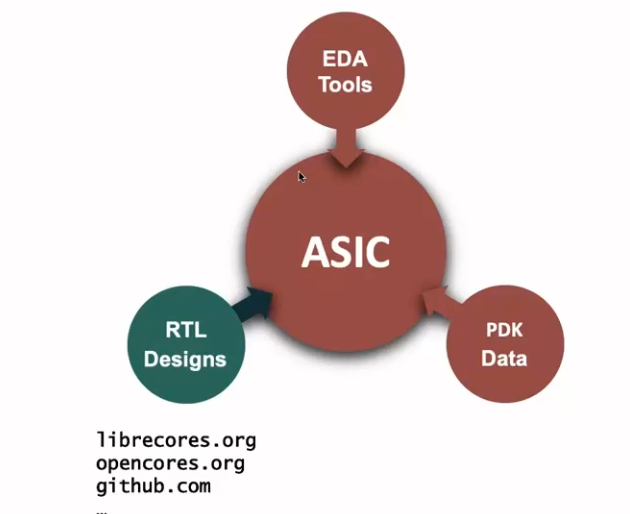

The above are the basic requirements to be able to generate a simple ASIC which can be stated as more 
than just a conceptual idea. something more real. 

> **skywater 130 nm process**: 
> This is technology that can be called deprecated as compared to the 5nm and 3nm processes that are 
>available on finfets today but this technology is capable of providing processors that can run really 
>fast, like the intel pentium made using 130nm which had a clock rate of 3.46 GHz and RISC-V cores on 
>pipelining can reach speeds well over 1GHz. while the technology may be old, it is still pretty useful 
>for learning and for applications which require maybe higher noise margins or channel lengths. 

### ASIC Design flow: 

An asic design flow is the process of beginning with rtl code and closing with a GDSII file. The flow consists of a process as shown below: 
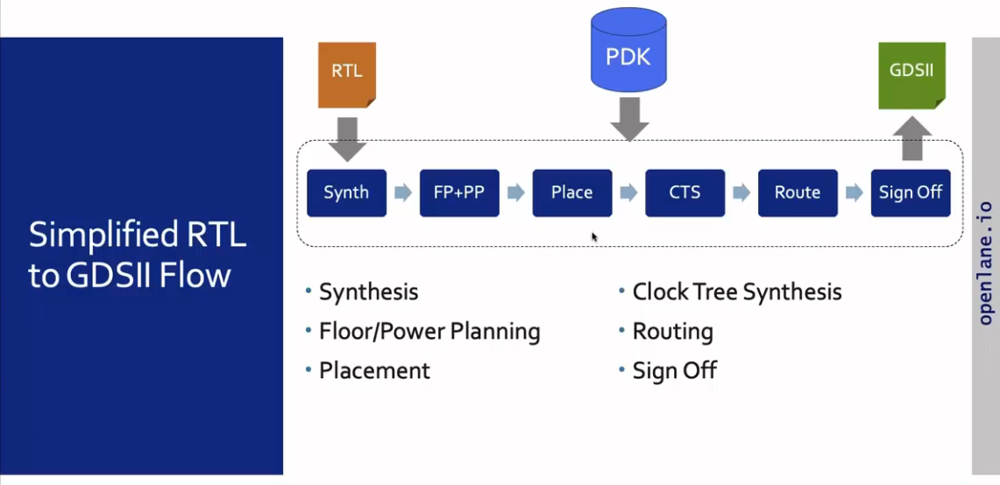

There are various steps involved in an ASIC flow as shown, each of them discussed in detail are as below: 

- **synthesis**: 
This is the process of converting RTL code to a circuit. Standard cell libraries are used in this 
process and these libraries have different views. The liberty view is viewieng things electrically, it 
looks at timing and power characteristics, .def files can be used to view layout related information and 
so on. At the end of synthesis, we have a netlist detailing connections across cells or logic components 
like muxes and gates and we do get a pictorial view from the synthesis tool as to how the circuit looks.
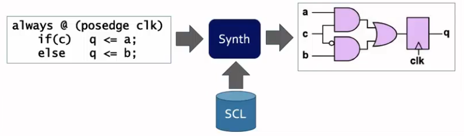 

- **Power Planning and Floor Planning**: 
Here, chip floor planning is done which places I/O pads and divides the die area across the various 
components that have to be fit in the chip like the ALU, the mux and all that. In Macro floor planning, 
we define macro dimensions, pin locations and rows which are to be used during placement and routing. 
Power planning ensures that all the supply and ground rails are laced across the chip in a way to reduce 
Electromigration and IR drop. The thicker metal layers are used as supply rails as there is lesser IR 
drop in them as compared to the thinner metal layers.
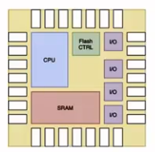  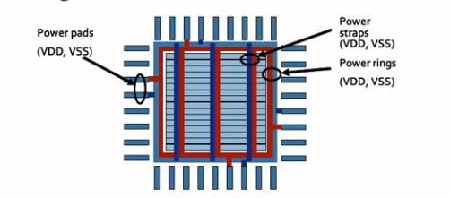   
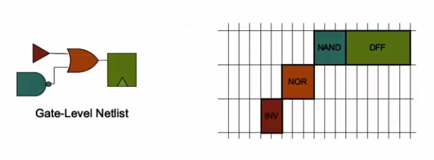

- **Placement**: 
We place the cells at this stage in the rows that we defined during floor planning. In global placement, 
we do a coarse placement of all cells and in detailed placement, we fine tune these cells in their 
placement so that they don't overlap with each other and fit into the rows as they are supposed to. 
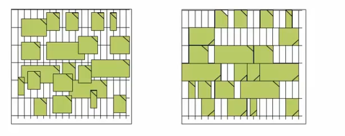

- **Clock Tree Synthesis**: 
Here we ensure that the clock signals reach all sequential elements such as flip-flops effectively and 
reach with minimum skew and almost no distortion. The structure is usually a tree.  
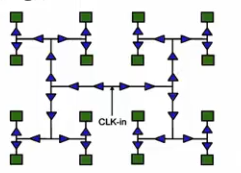

- **Routing**: 
There are 6 metal layers used in skywater130nm pdk, the lowest 1 being titanium and the 6 above being a
luminium. The routing process basically performs interlocking of grids and connects them with vias to 
ensure there is a clean transmission of signals. Global routing is done to obtain an overall structure 
and detailed routing is done to resolve any localized errors, overlaps and conflicts.
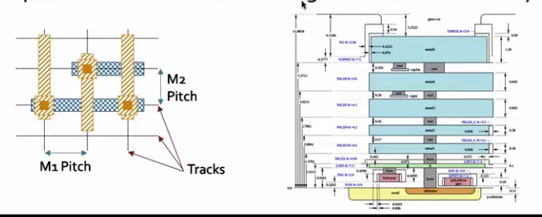

- **signoff**: 
checks such as DRC, LVS and STA are done to ensure that the circuit is good to go for production. 

### The OpenLane ASIC flow: 
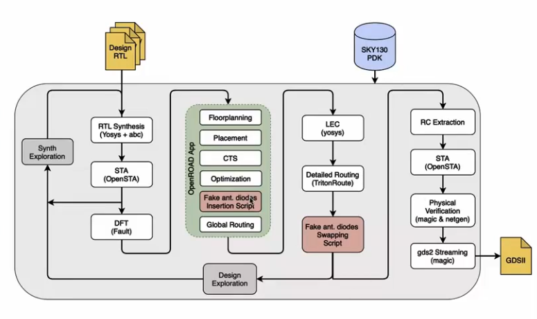

The above is the detailed asic flow of how things move in OpenLane, below are the various softwares used 
to build this flow
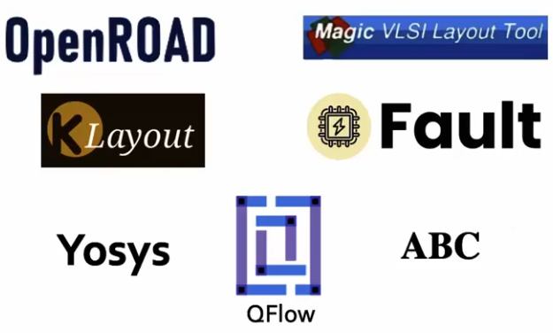

Components added to the simplified standard asic flow are: 

- **Synthesis exploration**: 
Allows you to explore the positioning across area and delay for various synthesis strategies, the ideal 
once can be picked based on the tradeoff requirements. 
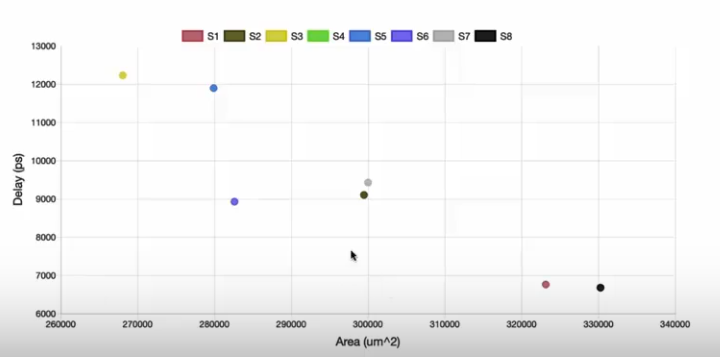

- **Design exploration**: 
Allows you to explore and compare around 35 metrics around designs, useful to choose OpenLane 
Configurations. Below is a sample of how it looks
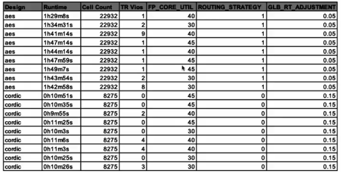

- **Regression Testing**: 
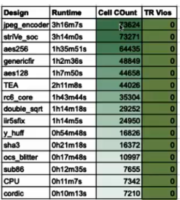
This shows violations, design metrics and configurations so we can pick an ideal configuration after 
testing many of them

- **DFT**: 
'Fault' the tool enables and performs DFT in the flow and also allows adding JTAG controller as an 
option to provide external access 

- **Logic equivalence check**
Furthermore, yosys can be used to compare the netlist obtained during physical design to the gate level 
netlist.

- **Fake antennas and diode insertion**: 
long interconnect/wire segments can act as antennas at times which is harmful to the existing transistor 
structure. To avoid this, we either incorporate this long section lower in the metal layers or we 
instead insert an antenna diode. OpenLane provides the option to add fake antenna diodes in magic at 
every input and then run the antenna checker. If a violation is reported, we replace the antenna by a 
real one. It also offers a solution to automatically insert antenna diode when needed or antenna 
violations can be checked using a new tool.

## Familiarization with EDA tools: 

