# DAY-2: Good floorplan vs bad floorplan and introduction to standard cells
## Chip floor planning considerations 
### floorplanning Theory
Consider a simple netlist having a launch ff, a capture ff and 2 logic gates in between. During physical 
design, the flipflops and the gates are rectangularly shaped and not shaped like their symbolic 
representation. This gives us a more idealistic way of looking at how cells occupy area on a die. a die 
is divided into many cores and a core is occupied by a netlist of size such that the area occupied by 
the net is significantly lower than that of the core. The ratio between the area occupied by the core 
and area occupied by the net is called utilization factor. The ratio of the height to width of the net 
is known as aspect ratio. 
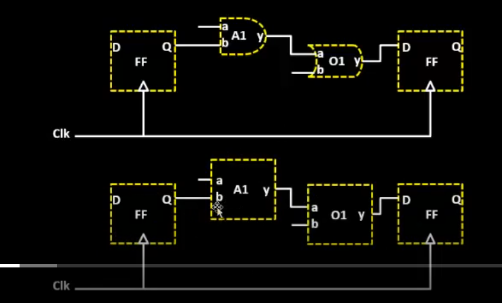

The net may be arranged in any way, need not follow the pattern as shown after synthesis. This enables 
us to pack chips in a core efficiently and then make the necessary connections. The net in a core could 
look something like below: 
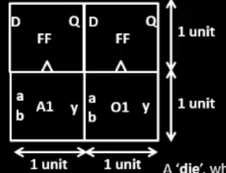


It is also possible that some netlists are complicated, too complicated or large to be forced into a 
core. Too big to be placed in the rows created during floorplanning etc. Thus we can split a net 
into multiple interconnected nets such that the output ports of a previous block are the input ports of 
a following block and so on. These cells are placed in the rows before we do placement and routing and 
thus are called preplaced cells. These cells can be reused. 


> **Decoupling capacitors:**
>IR loss is a big problem in circuits, whenever a circuit draws the current from the supply rail 
>directly, it is subject to receiving less than Vdd. When this voltage level drawn by the circuit lies 
>in the noise margin, it becomes a problem. To avoid this, capacitors are placed close to the circuitry. 
>these capacitors are charged to Vdd and can provide the circuit with maximal Vdd as they are close by. 
>These capacitors supply when the circuits are active and they charge from the supply rail when the  
>circuit is inactive. These capacitors decouple the circuit from the supply and hence are called 
>decoupling capacitors.

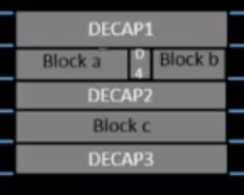

> **Ground bounce and Voltage droop:**  
> Ground bounce occurs when multiple circuits switch simultaneously, causing a temporary rise in the ground potential.  
> This is due to inductive effects in the ground path, which can lead to incorrect logic levels and timing issues.  
> Voltage droop, on the other hand, happens when the supply voltage temporarily drops below the desired level.  
> This occurs due to sudden current demands from the circuit, which can degrade performance and reliability.  
> To mitigate these issues, proper decoupling capacitors, optimized power distribution networks, and careful design practices are essential.  


**Power planning:**
A grid is made across the chip for the supply and ground rails, just like the rows in floorplanning. A mesh is formed which makes power supply available easily with less IR loss at most of the places in the chip. 

**Pin Placement:**
We align pins and cells in such a way that cells receiving the same input from input pins are close by, clocked elements like flip-flops are near each other to recieve the clocks, also being close to the clock pins. this makes sure of signal integrity with respect to the recieveing cells and ensures proper circuit function


### Lab-02 Floorplanning and power planning: 
**Configuration files:**
These files set environment variables for each step in the asic design flow, These environment variables 
can be overwritten by the project-specific config.tcl or the sky130_fd_sc_hd.tcl file but they set the 
environment for tools to begin work. Below is an example of the configurations as seen during 
floorplanning.
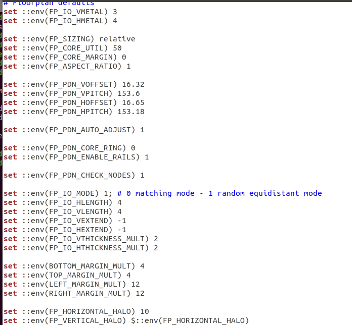

>Note: in openlane flow, metal indexing starts from 0 but may not be the case in tools and gui, 
> horizontal metal=3 means it actually is 4. This can be observed after the floorplan is done, in the 
>runs folder, under logs in ioPlacer.log

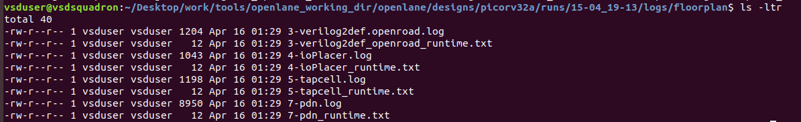

A def file is created during the floorplan which looks something like below: 
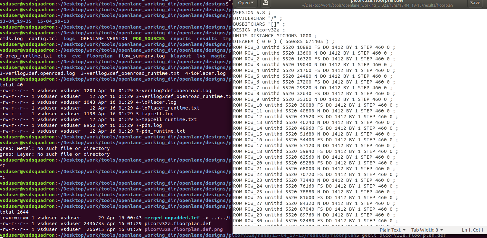

This def file is critical for defining die area, cell orientation and all that. The area can be 
calculated by looking at the die area parameters, dividing the larger coordinates by 1000 and then 
getting them in millimeter, as is defined in the line above the die area in the file, 1 db unit is 1000 
micron

>Die Area = (660685/1000)(671405/1000) = 443587 sq.um 

**viewing the layout on magic:**

3 files are required to specify and view the layout on magic: the .tech file, the .lef file and the .def 
file. 


- .tech (Technology File): 
This file defines the technology-specific parameters used in ASIC design, 
such as layer definitions, design rules, and manufacturing constraints. It provides the foundation for 
tools to understand the fabrication process and ensure compatibility with the manufacturing technology.
- .lef (Library Exchange Format): 
The .lef file provides an abstract view of the layout of standard cells, focusing on pin positions, 
routing layer information, and dimensions. It is primarily used during physical design tasks like 
placement and routing, helping tools optimize the chip layout.
- .def (Design Exchange Format): 
The .def file represents the physical layout of the chip, including details about cell placement, 
routing, and blockages. It plays a key role in communicating the design's physical structure between 
tools during verification and optimization stages.

the command used to invoke magic is 
```magic -T /home/Desktop/work/tools/openlane_working_dir/pdks/sky130A/libs.tech/magic/sky130A.tech lef read /home/Desktop/work/tools/openlane_working_dir/openlane/designs/picorv32a/runs/"latest_run"/tmp/merged.lef def read /home/Desktop/work/tools/openlane_working_dir/openlane/designs/picorv32a/runs/"latest_run"/results/floorplan/picorv32a.floorplan.def &```
a tcl command window and a layout window open, the layout window should look like this: 
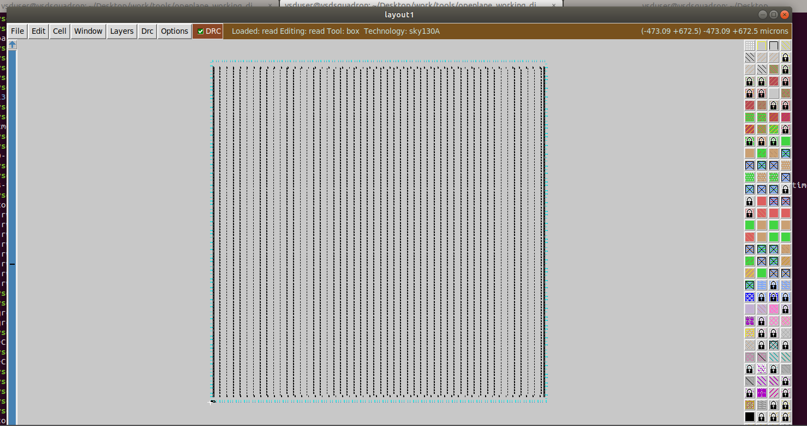

if we press S, the whole layout gets selected as we have selected nothing yet, then we press V if we 
want to centrally align the layout. if we want to highlight a specific area in the layout, go near the 
area, click left followed by right. The area is now selected and can be zoomed into. 

If we zoom enough and hover over a cell and then press S, we select the cell. The tcl command window that
opened along with the layout viewer can be used here. if we type 'what' after highlighting the necesary, 
the tcl command window can give us information as in the image below: 
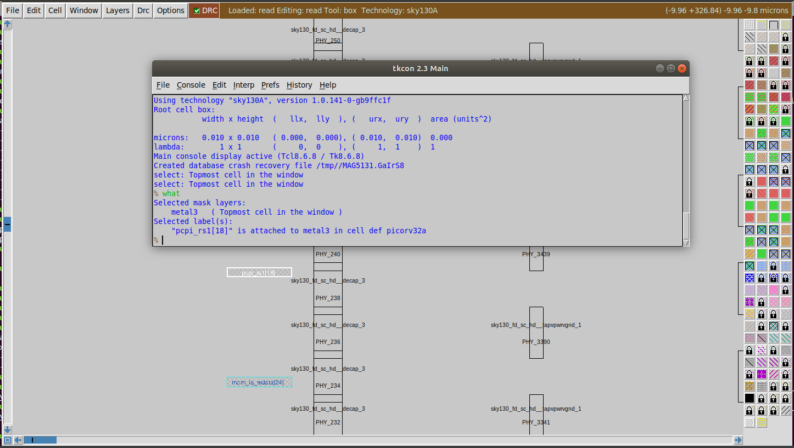


### Placement and Routing Theory: 
All cells as seen in synthesis diagrams and circuit diagrams are not in their specified shapes, all are
rectangular blocks that can be placed in a cell. These rectangular blocks these cells have their physical
and timing information. A collection of these information are called library. There are options for 
cells, there are variants of different sizes and timings. 

While placing cells, we may encounter problems such as sparsely placed cells for a netlist, then there 
could be distance between a cell and it's respective i/o pin. Thus we must optimize placements to have 
minimal distance across respective components. However, not in all cases will it be possible to have 
situations where signal integrity is maintained. Hence, we place repeaters (buffers) to re-generate the
signal and then provide it in significant strength to the next element in the desired netlist. 

Cells may be joined in order to avoid wire transmission delays. 

The routing for the netlist on the left may be done as that for the netlist on the right, Buff means
buffer and the rest are cells for ff, gates and all that. 

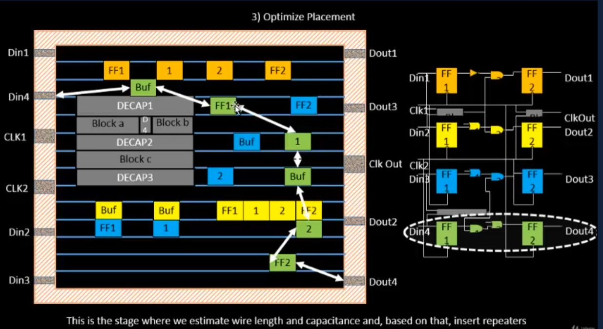

### Placement and routing labs: 

The following placement that is being done is done based on congestion only, no timing analysis is 
involved here. 

Placement is run in 2 stages as discussed in day-1, Detailed placement is required from a more timing 
point of view. Half parameter wire length is used in openlane to optimize. Placement is considered legal
when there are no overlaps across the cells in the design. 

```run_placement``` 
is used on the vm to run the placement. 

the placement is run and it writes some files and prints some design stats. They are as below:
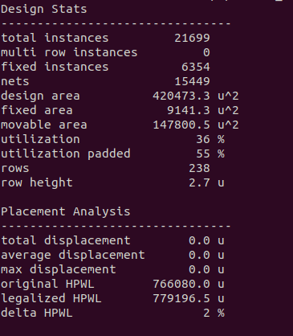

We can view the placed layout in magic. the command is similar, except for we use the new def file 
instead: 

```magic -T /home/Desktop/work/tools/openlane_working_dir/pdks/sky130A/libs.tech/magic/sky130A.tech lef read /home/Desktop/work/tools/openlane_working_dir/openlane/designs/picorv32a/runs/"latest_run"/tmp/merged.lef def read /home/Desktop/work/tools/openlane_working_dir/openlane/designs/picorv32a/runs/"latest_run"/results/placement/picorv32a.placement.def &```

the designname.placement.def file is in the below folder: 
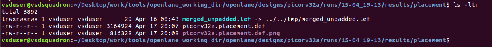

The layout: 


The layout can be zoomed into and explored just like it was done during floorplanning. 

**Cell design and library characterization:**
So libraries typically contain information about threshold voltage, drive strength and timing. These 
info can be used to model nets from existing cells that can then be used in the physical design of the 
circuit. It is important to choose thersholds after considering information like slew and delay so that 
there isn't any ambiguity in calculations. 

