# DAY-3: Design Library cell using magic and ngspice characterization
## CMOS Inverter ngspice simulations: 
###  Lab 

> Note: Openlane is flexible to changing across env variables and configurations in the middle stages, 
> If we had to run floorplan with different configurations than what currently is, it could absolutely > 
> be done with no hassles. Such as changing placement modes to occupy pins in an equidistant or proximal 
> to cells or in a stacked mode
## Inception of Layout and CMOS fabrication: 
**Spice simulations :**
- SPICE deck: 
    This is the 'netlist' in SPICE language, we prepare a schematic and all the connectivity information 
    about it is called SPICE deck. This information includes tap points, I/O points where measurements 
    are taken, points where circuits intersect and all that. Substrate connectivity also needs to be 
    specified. In SPICE, Components are defined as present between nodes, nodes are needed to define 
    components, as opposing to theoretical calculations.
    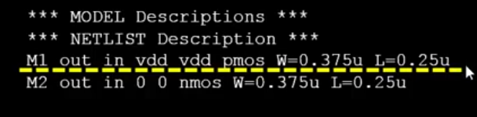
    This is an example of how SPICE nets are written, The nodes are out, in and vdd, the type is pmos,  
    the width and length are as written as assigned to W and L. The order of nodes connected for a 
    transistor is (drain, gate , source, substrate).

    Now like below, 
   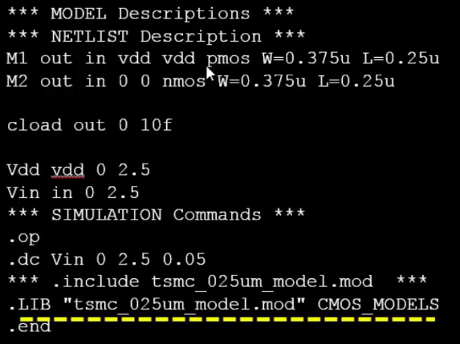

   The SPICE deck in the image is used to simulate an electronic circuit, specifically analyzing the 
   behavior of a CMOS inverter circuit. Below is a breakdown of its purpose and functionality:
   **Defining Components and Connections:**
    The deck specifies the components of the circuit:
        - **PMOS and NMOS transistors** 
            form the inverter, where the input voltage (`Vin`) controls the logic 
            state at the output (`out`).
        - **Capacitor (`cload`)** 
            models the output load to replicate real-world conditions.
    The deck includes two voltage sources:
    - **`Vdd`**: 
        Provides power to the circuit.
    - **`Vin`**: 
        Represents the input signal.
        Both are set to a DC voltage of **2.5V**, ensuring the inverter operates within its design range.
     - **`.op` Command**: 
        Performs an operating point analysis, identifying steady-state conditions (e.g., node voltages 
        and currents).
    - **`.dc` Command**: 
        Conducts a DC sweep of the input voltage (`Vin`) from **0V to 2.5V**, in steps of **0.05V**. 
        This allows the analysis of the inverter's output response across the input range.


- Using ngspice:
    We change to the directory as we would in a linux shell then we type 
    ```source path/file.cir``` where path is the path to the circuit file and file.cir is the circuit 
    file. 

    The command ```run``` will run the simulation.

    The command ```display``` will display the node information.  

    The command ```setplot``` will display the available plots (DC transfer characteristics in our case).

    The command ```plotname``` will register the plot to be displayed.

    The command ```plot node1 vs node2``` will display the voltage plot across the chosen nodes. 

    The plot will look something like this for an inverter: 
    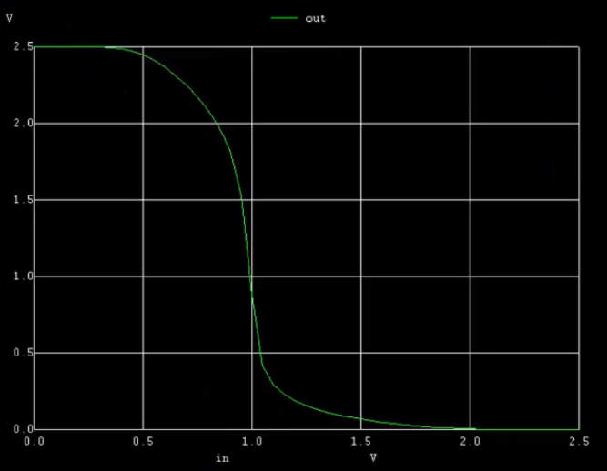

Coming back to the Inverter, the PMOS is always maintained thicker than NMOS, thick enough that the PMOS
is effectively switched off when the NMOS is on and vice versa. If they both are in saturation at some 
point in time, during the switching, it is highly possible that current leakage may occur. 

**Defining Input voltages in SPICE:**
The below line: 
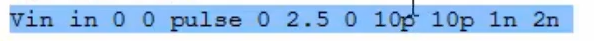
 
Defines a pulse voltage with a 0 to 2.5V peak-to-peak voltage, 0 offset, 10 ps rise and fall time
2ns cycle time with 1 ns pulse width and 2ns cycle time. 

**Making an inverter in magic**

Clone the repository `https://github.com/nickson-jose/vsdstdcelldesign.git` into the ~/Desktop/work/tools/openlane_working_dir/openlane. 

Copy the magic specific tech file into this folder from ~/Desktop/work/tools/openlane_working_dir/pdks/libs.tech/magic. 

Now, ```magic -T sky130A.tech sky130_inv.mag``` should open the inverter layout. 

This is how the folder should look: 
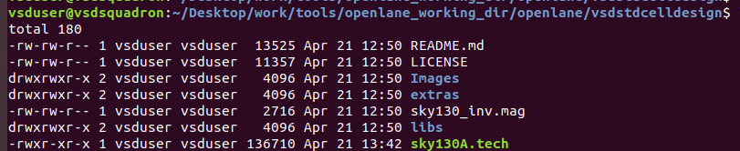

The layout: 
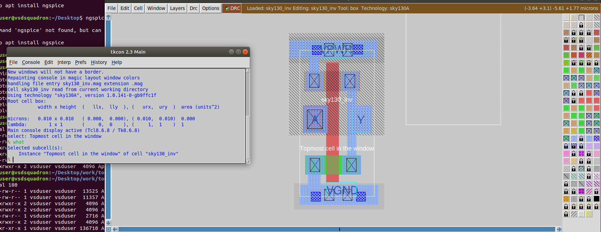

**16-Mask CMOS process:**
 1. Selecting a substrate: 
    Mostly, P-types are selected for this. The doping must be less than that of well doping. This is the 
    bulk of the transistor 

2. Creating active region : (MASK 1) 
    4 layers, the first is about 40nm of SiO<sub>2</sub>, the second layer is about 80nm of Si<sub>3</sub>N<sub>4</sub>
    the third layer is 1um of photoresist and the 4th layer is the mask. this mask is placed as a 
    protection for parts of the transistor where the layers are desired to be retained. 
    The process:
    uv light is shined on the top layer and the photoresist layer is removed. Then the rest of the 
    unprotected layers are etched away and finally, the protected layers having Si<sub>3</sub>N<sub>4</sub> 
    and the unprotected being bare SiO<sub>2</sub> are put into a furnace. the SiO<sub>2</sub> grows
    and thus causes insulation across transistors. This is to prevent communication across transistors 
    on the same wafer.This process is called LOCOS (Local oxidation of Silicon). The grown area is called
    bird break. After this, the Si<sub>3</sub>N<sub>4</sub> is etched out. 

3. Creating wells: (Mask 2 and 3)
    When wells are created, on a P-substrate, the rest of the top layer is protected and only the ones to
    be made into n-type transistors are exposed. The protection is done exactly as done in creating the 
    active region. Ion implantation is the method used to make wells. This process does damage the 
    silicon oxide layers which is recovered later. Boron is used to make P wells and Phosphorous is used
    to make N wells. This well is usually shallow and after putting it through a high temperature furnace
    , this well diffuses into the substrate significantly. This process is called diffusion. 

4. Formation of gates: (Mask 4 and 5)
    The wells are re-doped with a thin layer of their own material, shot at them with low energy, 
    then The Silicon oxide layer is replaced with a new healthy one, as the old one was damaged. 
    Then the new layer has another n type layer on top of it to reduce resistacne.    

5. Lightly doped drain (LDD formation): (mask 6 and 7)
    We look to achieve doping on the profile of P+, P- and N, for an N well. N is the channel, P- is the
    LDD and P+ is the source and drain. 

    There are 2 reasons to do LDD: 

    **Short Channel Effect:**
    The short channel effect occurs in MOSFETs when the channel length becomes comparable to the 
    depletion-layer widths of the source and drain junctions. As the channel length decreases, the control 
    of the gate over the channel weakens, leading to undesirable effects. One major consequence is 
    Drain-Induced Barrier Lowering (DIBL), where the drain voltage reduces the potential barrier at the 
    source, allowing current to flow even when the gate voltage is below the threshold. This results in a 
    reduction of the threshold voltage and increased leakage currents. Additionally, short channel effects 
    can cause punch-through, where the depletion regions of the source and drain merge, leading to 
    uncontrolled current flow.

    **Hot Electron Effect:**
    The hot electron effect arises when electrons in the channel gain high kinetic energy due to strong 
    electric fields, typically near the drain of a MOSFET. These "hot" electrons can overcome the potential 
    barrier and get trapped in the gate oxide, causing a shift in the threshold voltage and degrading the 
    device's performance over time. This effect is more pronounced in short-channel devices, where the 
    electric fields are stronger. Hot electrons can also lead to reliability issues, such as oxide breakdown 
    and reduced device lifespan.

6. Source and drain formation: (Mask 8, 9 and 10)
    Now for the doping, They are doped in a similar manner as to well creation but are done with the 
    channel being protected by a mask. 
    Plasma anisotropic etching is done in order to keep the drain and source intact just on the side of
    the channel. When this drain and source are kept intact, they are unaffected by further doping and 
    the uncovered regions are doped with further of the same type of N and P, whatever is present to form
    source and drain. These newly doped regions are P- or N+ accordingly and the undoped P+ and N- 
    accordingly. 
    So NPN transistor more like N+N-PN-N+ and PNP more like P+P-NP-P+
    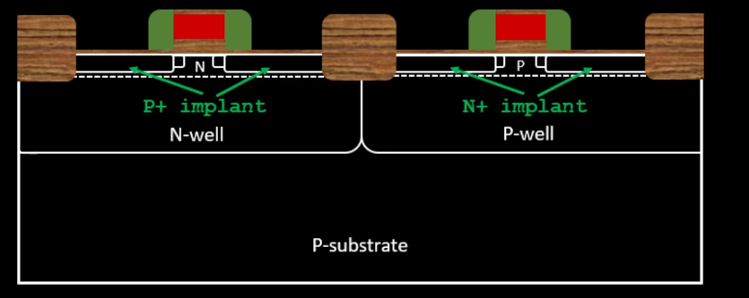


7. Contact formation: (Mask 11)  
    Titanium is sputtered on the metal and the contacts that need to be maintained are convered, the rest
    are etched off. This makes metal contacts visible and accessible for gate source and drain. 

8. Higher level metal formation: (Mask 12, 13, 14, 15 and 16)
    A thick layer of Silicon oxide is put over the top layer and then polished to make the surface linear
    This layer is etched out to make way for contact, tungsten is filled in in the shape of the contact 
    and aluminium is then placed on top. During the proces TiN (titanium nitride) so that it acts as an 
    etching barrier for lower metal layers. Aluminium acts as contact between metal layers and the 
    process repeats for each layer, deposit thick SiO<sub>2</sub>, Then etch the areas to be exposed
    then fill the exposed areas with tungsten, then fill aluminium layer on top of tungsten, each upper
    layer is thicker than the lower layer. Silicon Nitride is then used to protect the whole layer and 
    mask is used to bring out the metal contacts, out of the protective layer

### Labs 

> When poly crosses N diffusion, it is NMOS and when it crosses P diffusion it is PMOS, the layer info 
> is available on the top right when the metal icons are hovered over. 

In a LEF format, the logic is unclear, it is absent, the LEF has only metal information. The README in 
the vsdstdcelldesign has all information about how to create layout in magic. 

**MAGIC DRC, PEX and all SPICE extraction:**

The magic tool can be used to perform DRCs, it automatically checks DRCs and offers to correct them. 
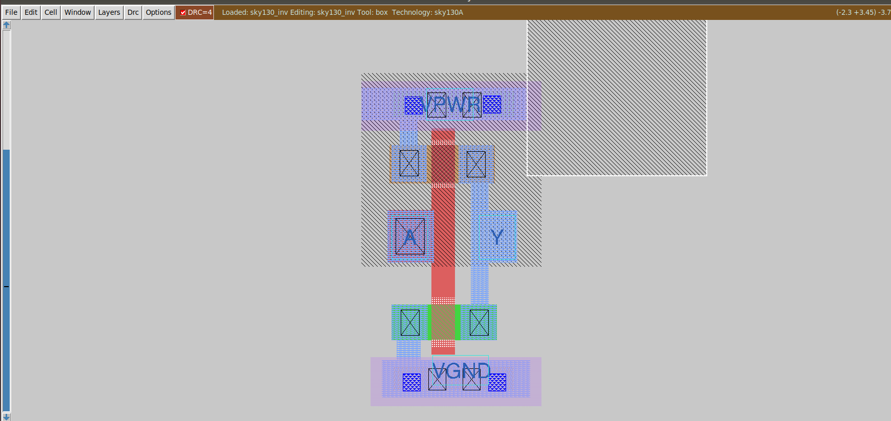

As can be seen in the image, the design has been messed with and has errors. the dotted area in the DRC 
is the erroneous area, this needs to be fixed until DRC is 0. 

On selecting go to next error, under the DRC dropdown we see the below: 
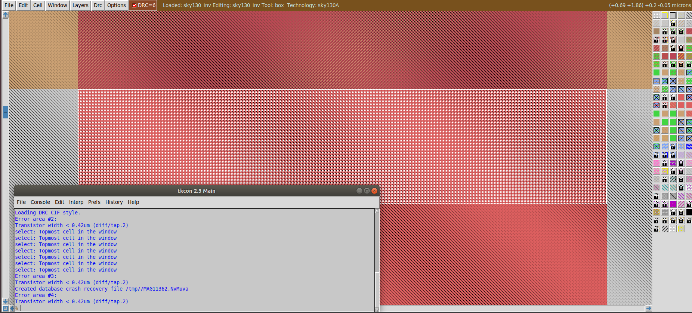

we can move the layout around to fix all such drc errors and move. 

**Generating the spice deck and parasitic extraction:** 
This can be done by using the command ```extract all``` in the tkcon window in magic or we could use
```ext2spice cthresh 0 rthresh 0``` and then ```ext2spice``` to extract parasitics into a spice deck. 
this should generate 2 files
sky130_inv.ext for the first command and sky130_inv.spice. 

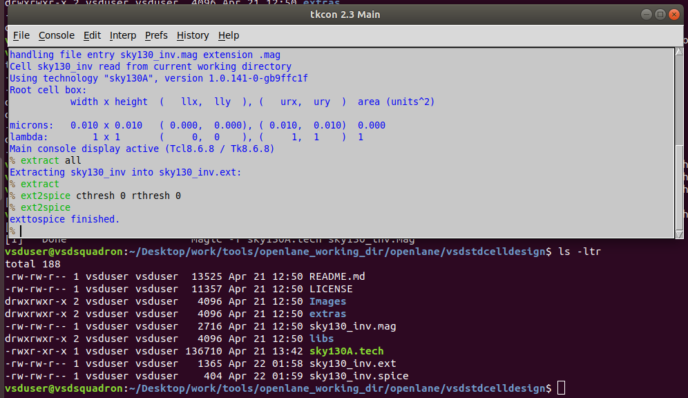

Now the extraction is complete. 

## Tech file labs: 
**Working with the extracted spice deck:**
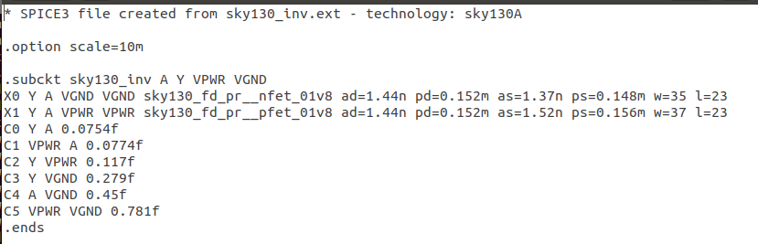
The extracted spice deck looks like this, having extracted teh parasitic capacitances. 

We modify the spice deck to include certain voltage waveforms and models, it should looks like this: 
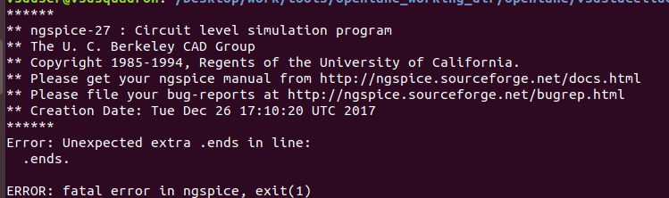

The spice deck should output a waveform like this: 
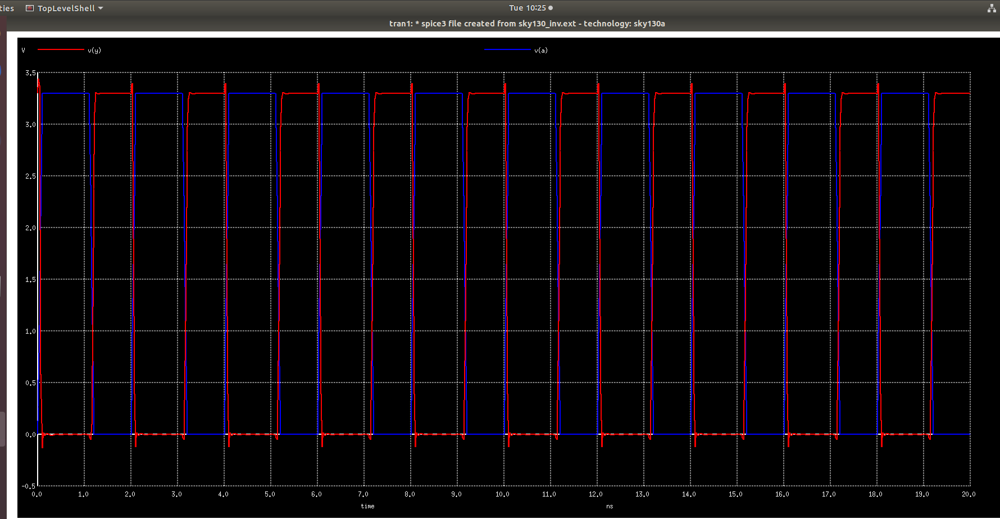

The inverter waveform. This can be used to calculate rise time, fall time, slew and all that, if we zoom
into the waveform and click on a point, the shell indicates what point it is. Just as below:  
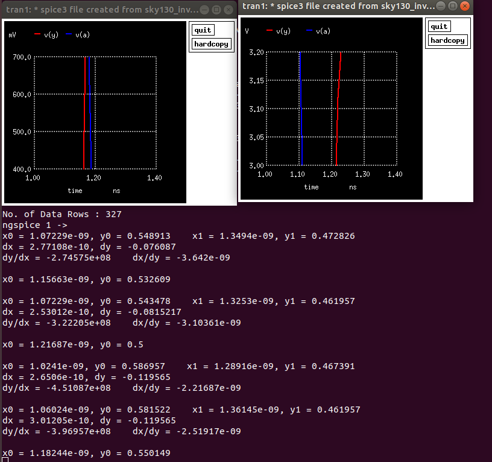

> Rise time = 0.05868ns

> fall time = 0.0735ns

> Propagation delay = 0.03148ns


