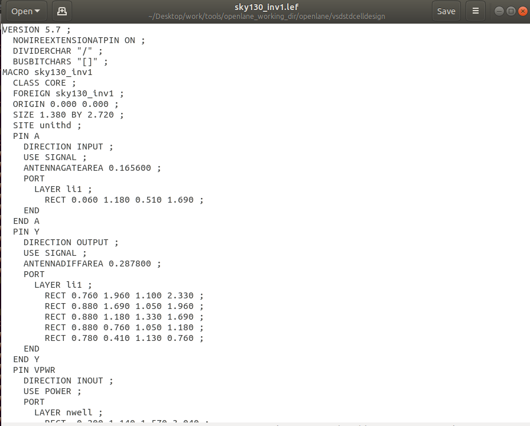

# Pre-Layout Timing analysis and importance of a good clock Tree: 
## Timing modelling using delay tables: 
### Lab

A lef file needs to be extracted from the drawn magic layout, this can be done using the tkcon window 
just as done for extracting the spice netlist. 
This LEF file can easily be plugged into another design. This part of it has only metal layer 
information, no logical or functional information. 

The tracks.info file: 
A tracks.info file or tracks file helps identify the area covered by the various layers of metal that are
used in the layout. This information is valuable for routing automation tools to make sure and refer 
paths that can be drawn to route signals. The file looks as is below: 


This information states area covered by the cells in coordinates. This area is open for routing.

The x pitch is the shift per grid size in x direction, quantized usually as the smallest x dimension 
available on the system. but can be taken as desired, to form the grid in magic, use
`grid <gridsize>`

Refer to vsdstdcelldesign documentation for further info but magic can help in labeling pins as input, 
output, VDD, etc.

on the tkcon window, commands like `port class output` and `port use signal` or `port use power/ground` 
can be used.

Creating the LEF file, 
The command ```lef write``` can be used to create a lef file with the same name as that of the inverter
used. Since we have changed the name to sky130_inv1.mag, the lef file created will be sky130_inv1.lef .


The lef file should look like: 


Port enable checkbox on being checked creates pins in lef files. Written in the order as specified in 
the magic label. 

**Adding the new cell in picorv32a:** 
Include the files under /vsdstdcelldesign/libs and the lef file that was generated using magic into the 
designs/picorv32a/src folder. Then edit the config.tcl file in designs/picorv32a folder to as it is 
below:


This picorv32a/designs/src folder should look like: 


This should merge the inverter into the design. 
refer to vsdstdcell design repo for info


In clock tree synthesis (CTS), delay tables play a crucial role in designing an optimized clock 
distribution network. They model the delays of clock buffers and interconnects based on parameters like 
load capacitance, input slope, and environmental conditions. This allows CTS tools to place and size 
buffers effectively, balancing the clock signal’s propagation delay to minimize skew across all 
endpoints. Furthermore, delay tables assist in reducing uncertainties and guide the clock tree 
optimization process, ensuring the clock signal reaches all sequential elements reliably.

In static timing analysis (STA), delay tables are indispensable for evaluating the timing of a design. 
They provide information about gate and interconnect delays, helping STA tools calculate accurate 
propagation delays across various paths. These tables capture dependencies like output load, input slew, 
and environmental variations (e.g., voltage and temperature). By doing so, delay tables ensure STA can 
validate setup and hold timing constraints, detect violations, and account for best-case and worst-case 
scenarios.

A delay table looks like: 


The plot is for input slew vs output load, wherever they intersect, say for the buffer in our case, 
The delay table depends on the size of the element (buffer in our case) involved, which is a reflection
of the aspect ratio of the nmos and pmos. The delay varies because RC varies with aspect ratio. 

> For values not given, extrapolation can be done to estimate the delays. 

> Note: Try adding cell again and seeing, try adding the $lef variable inline and not in the config file

## timing modelling using openSTA: 

**Setup time** 
is the minimum amount of time that a data signal must be stable at the input of a flip-flop before the 
active clock edge. This ensures that the data is correctly captured by the flip-flop without errors. If 
the setup time requirement is violated, the flip-flop may fail to latch the correct data, leading to 
potential timing violations. Designers aim to optimize the circuit to meet setup time constraints by 
adjusting clock periods, reducing delays in critical paths, or employing better buffer and gate sizing 
strategies.

**Hold time** on the other hand, refers to the minimum duration for which the data signal must remain 
stable after the active clock edge. This ensures that the flip-flop has sufficient time to latch the 
correct data without interference from subsequent signals. Violations of hold time typically occur due 
to signal races or excessively fast paths. Resolving hold time issues often involves introducing 
additional delays using buffers or redesigning the fast paths

**Jitter** 
represents the variability in the clock signal’s timing. It arises due to factors like power 
supply noise, process variations, or environmental conditions. Jitter can cause the clock edges to shift 
from their ideal positions, potentially leading to timing violations. In STA, jitter is accounted for as 
part of timing margins to ensure that even with variability, the design operates reliably under 
worst-case conditions.

**Skew** 
is the difference in arrival times of the clock signal at various sequential elements 
within the circuit. In an ideal design, the clock signal should reach all elements simultaneously. 
However, due to varying interconnect delays, clock buffers, and routing, skew is inevitable. Positive or 
negative skew can impact setup and hold timing, and excessive skew can cause functional failures. Clock 
tree synthesis (CTS) is specifically designed to minimize skew and balance the clock distribution.

**Uncertainty** 
is a broader term that encompasses all forms of unpredictability in timing, including jitter, skew, 
process variations, and modeling inaccuracies. It acts as a safety margin during STA, ensuring that the 
design remains functional under worst-case scenarios. Timing uncertainty is factored into the clock 
period budget, allowing for robust operation even with the inherent imperfections in the system.

### Lab for post synth timing analysis: 
> As mentioned earlier, the provided README file, in the path /openlane_working_dir/openlane/
> configuration can be used to analyze, learn and use openlane in different modes to optimize for time, 
>area etc. These settings can be changed in the middle of the 
>script. 

>>>> *WRITE SDC AND pre_sta.conf FILE*

Use ```sta filename``` to run sta

> report_net -connections pinnumber shows us connection info
> sta pre_sta.conf should trigger the sta from a normal shell. rest commands pasted on whatsapp on sta shell.

After replacing cells, we can use write verilog in the sta shell to extract the new replaced netlist
optimized for time. This must be replaced in runs/run/results/synthesis/ replacing picorv32a.synthesis.v

> go to scripts folder to see the procs for all commands, use gpt here. 

**Post layout timing analysis:**

Go into openroad, type `openroad` in the openlane tcl shell and then use the inbuilt opensta.

First in openroad, we create the db from the lef and def files. 
```read _lef /openLANE_flow/designs/picorv32a/runs/<run id>/tmp/merged.lef```
to read the lef file and  

```/openLANE_flow/designs/picorv32a/runs/<run id>/results/cts/picorv32a.cts.def``` 
to read the def file

then write the db using the command 
```write_db filename.db```

Now read the netlist using 
```read_verilog openLANE_flow/designs/picorv32a/runs/<run id>/results/synthesis/picorv32a.synthesis.v```

Then read the lib files, max and min. 

For max: 
```read_liberty -max $::env(LIB_MAX)```

for min: 
```read_liberty -min $::env(LIB_MIN)```

Read an sdc file here as: 
```read_sdc [path to sdc]```

Then use
```set propagated clock [all clocks]```

finally use 
```report_checks -path_delay min_max -format full_clocks_expanded -digits``` 

> Note: for the typical corner, CTS won't see violations mostly, This is a tritoncts issue

Edit env variable, delete any 1 clock buf from list and then check check again. 

Without any edits, slack seems to be violated after cts. 


> before running cts, make sure the env variable $env::CURRENT_DEF must be set to the def file in 
>/runs/"<run id>"/results/placement/picorv32a.placement.def 

use `report_clock_skew -setup/hold etc` and commands like that to explore individual sta parameters. 

