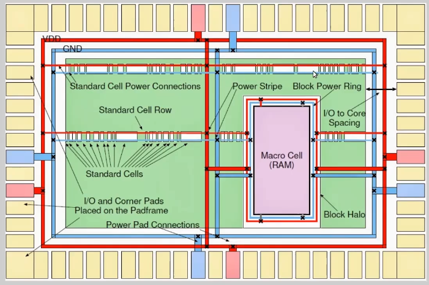

# Final steps for RTL2GDS using tritonroute and opensta
## Intro to routing algorithms
**Maze routing algorithm:**
The Maze routing algorithm is a fundamental pathfinding technique used in digital circuit design and PCB 
layout. It systematically searches for a path between a source and target node in a grid-based 
representation of a circuit, ensuring that obstacles and routing constraints are respected. The 
algorithm operates using breadth-first search (BFS) by expanding from the source node in all possible 
directions while marking visited nodes. It continues until the target node is reached, resulting in the 
shortest path. Once the path is found, backtracking is performed from the target node to the source to 
trace the complete route. While simple and effective for finding the shortest path, the algorithm can be 
computationally expensive for large grids due to exhaustive exploration.

Design Rule Checks (DRCs) related to routing are crucial for ensuring that electrical connections in a 
circuit meet manufacturing and operational constraints. They help validate whether the routing adheres 
to physical design specifications and prevents issues like signal integrity problems, fabrication 
failures, and unexpected circuit behavior. Key DRCs in routing include **minimum width** rules that 
ensure traces are wide enough to carry current without overheating, and **spacing rules** that maintain 
adequate clearance between adjacent wires to avoid short circuits or electromagnetic coupling. **Via rules**
govern the placement and dimensions of vias to ensure proper electrical connectivity between 
layers, while **metal density rules** ensure uniform material distribution across the chip for balanced 
manufacturing. **Routing layer assignments** ensure specific signals use designated layers, avoiding 
congestion and interference. Together, these DRCs ensure the design is manufacturable, reliable, and 
optimized for performance.

## Power distribution network: 
### LAB: 
> Note: prep -design designname -tag runID will load a previous run. 

`gen_pdn` will initiate and create the power distribution flow. 

Power distribution network: 


**Routing:**
Do routing by entering ```run_routing``` in the tcl shell. 

The detailed routing will be done by tritonroute and the global route is done by fastroute. 

Once routing is done, it will leave behind a .drc file. Any violations here are to be dealt with manually. 

**SPEF Extraction:**
This part is done outside openlane, in the work/tools/SPEF_Extractor directory. It is a python script. 

So the following command, 
```python3 main.py <path to merged.lef> <path to runs/<runID>/results/routing/designname.def>```

This will create a SPEF file in the runs/<runID>/results/routing folder.

> The new netlist before routing(design_preroute.v) and the def file after routing. 
> This is used as read verilog for post routing sta.